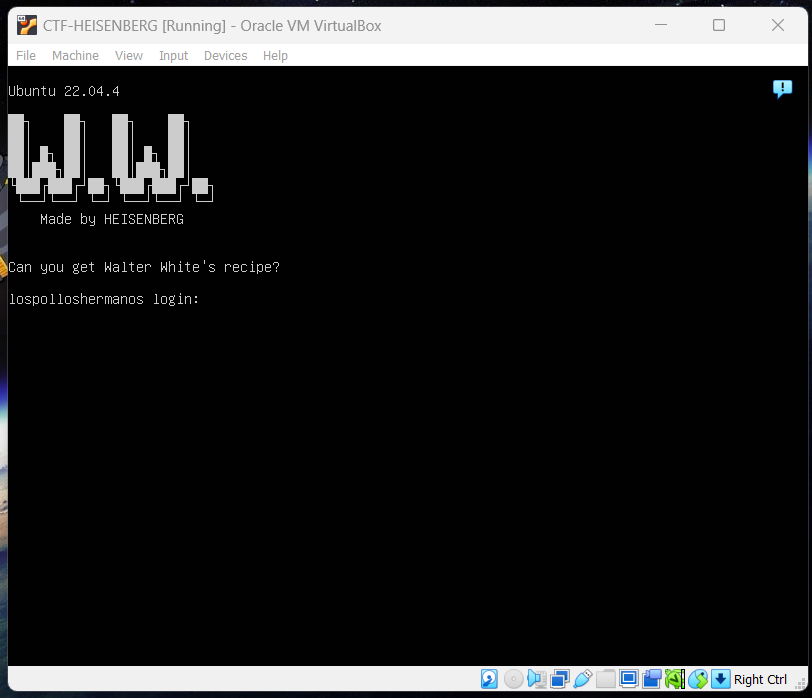

<h1>BreakingBad CTF</h1>
<h3><i>Can you get Walter White's recipe?</i></h3>

   
 
<a href="https://drive.google.com/file/d/1qtUS-wY-7sxRNoNIqSV8UFSkf7gKkCaM/view?usp=sharing">Get the Box</a>

<h2>Description</h2>
<h3><b><i>Get the flags, Root the machine and get Walter White's recipe!</i></b></h3>

Tested on VirtualBox

<b>Difficulty: </b> Easy

<b>Operating System: </b>Linux

<b>Format: </b>Virtual Machine (Virtualbox - OVA)

<b>Filename: </b>BreakingBad-CTF.ova

<b>File Size: </b>1.55G

<b>MD5: </b>e21e8937a24daba1082ac6bf18348e59

<b>SHA256: </b>ed14dd051130e04c088dc6e841df7d38a6632cba990aa2c9e84c5d5b349390b2

