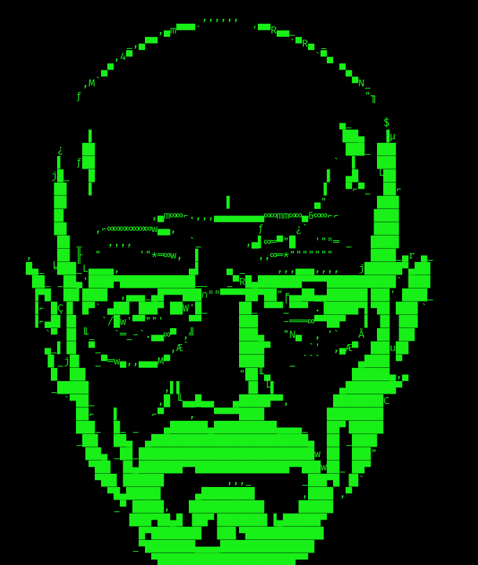

<h1>BreakingBad CTF</h1>
<h3><i>Can you get Walter White's recipe?</i></h3>

 
<a href="https://drive.google.com/file/d/1sV8dcL1Gth5fb0WNYUbqSIFtssVeLPVT/view?usp=sharing">Link to the CTF</a>
 

<b>Difficulty: </b> Easy

Format: Virtual Machine (Virtualbox - OVA)

Operating System: Linux

<b>There are 3 flags and Walter White's recipe!</b>

<i>For all the BreakingBad fans!  This is the first CTF made by me, I loved the process and it was a lot of fun. <b>I hope you will love this box too!</b></i>

